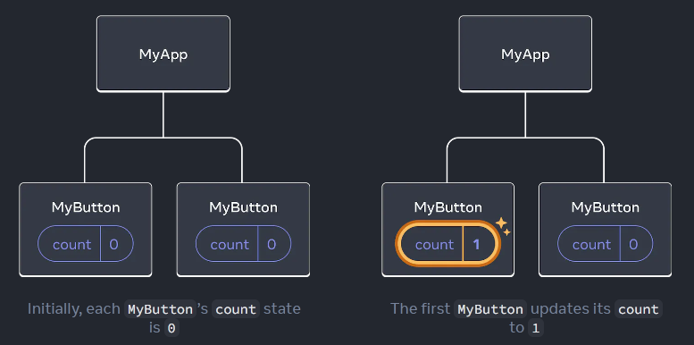

# React Quick Start

🔗 [Learn React Source](https://react.dev/learn)  
🔗 [Installation Resources](https://react.dev/learn/installation)

## Overview

- [How to create and nest components](#creating--nesting-components)
- [How to add markup and styles](#adding-styles)
- [How to display data](#displaying-data)
- [How to render conditions and lists](#conditional-rendering)
- [How to respond to events and update the screen](#responding-to-events)
- [How to share data between components](#sharing-data-between-components)

## Creating & Nesting Components

🔗 [Source](https://react.dev/learn#components)

**Component** is a piece of the UI that has its own log and appearance. This is something that can be as small as a button, or as large as an entire page. 

JavaScript/TypeScript functions are what React **components** are composed of and return markup.

### Example: `MyButton()` Component

React **component** for a button

```tsx
function MyButton() {
    return (
        <button> I'm a button</button>
    );
}
```

Nesting the `MyButton` **component** inside of another **component**


```tsx
export default function MyApp() {
    return (
        <div>
            <h1>Welcome to my app</h1>
            <MyButton />
        </div>
    );
}
```

`<MyButton />` starts with a capital letter due to React **components** are required to start with a capital letter. HTML tags are required to be lowercase. 

`export default` indicates that this is the main component in the file. 

Rendered Result ⬇️


## Writing Markup with JSX

🔗 [Source](https://react.dev/learn#writing-markup-with-jsx)  
🔗 [JSX Online Converter](https://transform.tools/html-to-jsx)  
🔗 [JSX Wiki](https://en.wikipedia.org/wiki/JSX_(JavaScript))

What is **JSX**?  
**JSX** is stricter than HTML, requires tags to be closed, and can't return multiple **JSX** tags. **JSX** tags will need to be wrapped into a shared parent, like a `<div>...</div>` or `<>...</>`.

## Adding Styles

🔗 [Source](https://react.dev/learn#adding-styles)

Specify a CSS class with `className`, it works the same way as the HTML `class` attribute. 

```tsx

```

```css
.avatar {
    border-radius: 50%
}
```

React does not have a specific way how CSS files are added. The simplest case, you'll add a `<link>` tag to your HTML. 

If using a build tool or a framework, consult its documentation to learn how to add a CSS file to your project.

## Displaying Data

🔗 [Source](https://react.dev/learn#displaying-data)  
🔗 [Resource for complex expressions inside JSX curly braces](https://javascript.info/operators#string-concatenation-with-binary)

JSX lets you put markup into JavaScript/TypeScript. The curly braces, `{}`, enable the ability to embed some variable from your code and display it to the user. 

### Example: `user.name` displayed as an H1 Heading

```tsx
return (
    <h1>
        {user.name}
    </h1>
);    
```

This can also work with JSX attributes, but curly braces `{}` are used instead of quotes. 

### Example: `user.imageUrl` Variable Value Used for `src` Attribute

```tsx
return(
    
);
```

### Example: Using an Object Inside `style={}`

```tsx
const user = {
    name: 'Hedy Lamarr',
    imageUrl: 'https://i.imgur.com/yXOvdOSs.jpg',
    imageSize: 90,
};

export default function Profile() {
    return (
        <>
            <h1>{user.name}</h1>
            
        </>
    );
}
```

Rendered Result ⬇️


## Conditional Rendering

🔗 [Source](https://react.dev/learn#conditional-rendering)

There's no special syntax for writing conditions, the same technique is used when writing regular JavaScript/TypeScript. 

### Example: Using an `if` Statement to Conditionally Include JSX

```tsx
let content; 

if (isLoggedIn) {
    content = <AdminPanel />;
} else {
    content = <LoginForm />;
}
return (
    <div>
        {content}
    </div>
);
```

### Example: Using the Ternary Operator `?` to Conditionally Include JSX

🔗 [Ternary Operator Resource](https://developer.mozilla.org/en-US/docs/Web/JavaScript/Reference/Operators/Conditional_Operator)

```tsx
<div>
    {isLoggedIn ? (
        <AdminPanel />
    ) : (
        <LoginForm />
    )}
</div>
```

### Example: Using Logical `&&` When an `else` branch is not needed

🔗 [Logical && Resource](https://developer.mozilla.org/en-US/docs/Web/JavaScript/Reference/Operators/Logical_AND#short-circuit_evaluation)

```tsx
<div>
    {isLoggedIn && <AdminPanel />}
</div>
```

## Rendering Lists

🔗 [Source](https://react.dev/learn#conditional-rendering)

To render a list of components, the JavaScript/TypeScript `for` loop and the array `map()` function can be used. 

🔗[for Loop Resource](https://developer.mozilla.org/en-US/docs/Web/JavaScript/Reference/Statements/for)  
🔗[Array map() Function Resource](https://developer.mozilla.org/en-US/docs/Web/JavaScript/Reference/Global_Objects/Array/map)

### Example: Displaying an Array of Products

Array of products

```tsx
const products = [
    { title: 'Cabbage', id: 1 },
    { title: 'Garlic', id: 2 },
    { title: 'Apple', id: 3 },
];
```

Using the `map()` function to display an array of products as an array of `<li>` items

```tsx
const listItems = products.map(product =>
    <li key={product.id}>
        {product.title}
    </li>
);

return (
    <ul>{listItems}</ul>
);
```

**Note:** `<li>` has a `<key>` attribute, this is to help React know what happened if you later insert, delete or reorder items. This value should be coming from your data, such as a database ID. 

### Example: Complete Demonstration of Rendering a List of Products

Using the `map()` function to create a `const` named `listItems` and returned as a **React component**. 

```tsx
const products = [
    { title: 'Cabbage', isFruit: false, id: 1 },
    { title: 'Garlic', isFruit: false, id: 2 },
    { title: 'Apple', isFruit: true, id: 3 },
];

export default function ShoppingList() {
    const listItems = products.map(product =>
        <li
            key={product.id}
            style={{
                color: product.isFruit ? 'magenta' : 'darkgreen'
            }}
        >
            {product.title}
        </li>
    );

    return (
        <ul>{listItems}</ul>
    );
}
```

Rendered result ⬇️


## Responding to Events

🔗 [Source](https://react.dev/learn#responding-to-events)

Declaring an **event handler** functions inside components are how events can be responded to. 

```tsx
function MyButton() {
    function handleClick() {
        alert('You clicked me!')
    }
}

return (
    <button onClick={handleClick}>
        Click me
    </button>
)
```

**Note:** Event handlers DO NOT need to be called. They only need to be passed down by using `{}`. See in example above, `onClick={handleClick}`.

## Updating the Screen

🔗 [Source](https://react.dev/learn#updating-the-screen)

In order for a **component** to "remember" some information and display it, **state** will need to be added to the **component**.

🔗 [Resource for useState from React](https://react.dev/reference/react/useState)

First, import useState from React

```tsx
import { useState } from 'react';
```

Then a **state** variable can be declared inside the **component**.

```tsx
function MyButton() {
    const [count, setCount] = useState(0);
    // ...
}
```

`useState` is a React Hook that allows a state variable to be added to a component.

Two things come from `useState`

1. The current state (`count`)
2. The function that allows it to be updated (`setCount`)

Any other names can be used for `count` and `setCount`, but the convention is to write `[something, setSomething]`.

The first time the button is displayed, `count` will be `0` since it was passed `0` to `useState()`. 

When wanting to change state, call `setCount()`, and pass a new value to it. 

```tsx
function MyButton() {
    const [count, setCount] = useState(0);

    function handleClick() {
        setCount(count + 1);
    }

    return (
        <button onClick={handleClick}>
            Clicked {count} times
        </button>
    );
}
```

Adding in the function `handleClick()` results in `count` being incremented by `1` each time the the button is clicked. 

### Example: Rendering the Same Component Multiple Times

When rendering the same **component** multiple times, each will get it's own state. 

```tsx
import { useState } from 'react';

export default function MyApp() {
    return (
        <div>
            <h1>Counters that update separately</h1>
            <MyButton />
            <MyButton />
        </div>
    );
}

function MyButton() {
    const [count, setCount] = useState(0);

    function handleClick() {
        setCount(count + 1);
    }

    return (
        <button onClick={handleClick}>
            Clicked {count} times
        </button>
    );
}
```

Rendered result ⬇️


## Using Hooks

🔗 [Source](https://react.dev/learn#using-hooks)

Functions starting with `use` are called **Hooks**.

`useState`, a React Hook that was used in the previous "Rendering the Same Component Multiple Times" example is a Hook that is **built-in** to React. There's also the potential to write **custom Hooks** by combining the existing ones. 

🔗 [Built-In Hooks API Reference](https://react.dev/reference/react)

Hooks are **more restrictive** than other functions. They can only be called at **the top of a React component or other Hooks**. If `useState` was going to be used in a condition or a loop, a new component would need to be extracted and the `useState` Hook can be put there.

## Sharing Data Between Components

🔗[Source](https://react.dev/learn#sharing-data-between-components)


In the previous `MyButton` example, each component had its own independent `count`. When each button was clicked, only the count for the button clicked changed. 



In order to share the data between components, so that the data can be updated together, the **state** would need to be moved "upwards" to the closest component containing all of them. 


With the **state** configured this way, when either button is clicked, the count will change for both. 

### Example: Update `MyButton` to Share Data Between Components

Here the **state** is moved up from `MyButton` to `MyApp`

```tsx
export default function MyApp() {
    const [count, setCount] = useState(0);

    function handleClick() {
        setCount(count + 1);
    }

    return (
        <div>
            <h1>Counters that update separately</h1>
            <MyButton />
            <MyButton />
        </div>
    );
}

function MyButton() {
  // ... we're moving code from here ...
}
```

Then, the **state** is passed **down** from `MyApp` to each `MyButton`. This can be accomplished by using the JSX curly braces `{}`, just like what was previously done with the built-in tags like ``

```tsx
export default function MyApp() {
  const [count, setCount] = useState(0);

  function handleClick() {
    setCount(count + 1);
  }

  return (
    <div>
      <h1>Counters that update together</h1>
      <MyButton count={count} onClick={handleClick} />
      <MyButton count={count} onClick={handleClick} />
    </div>
  );
}
```

When information is passed down like this, it's called **props**.

Now the `MyApp` component contains the `count` **state** and the `handleClick` **event handler**, and passes **both** as **props** to each of the buttons. 

`MyButton` is updated to **read** the props that are passed from its parent component.

```tsx
function MyButton({ count, onClick }) {
    return (
        <button onClick={onClick}>
            Clicked {count} times
        </button>
  );
}
```

- `onClick` **handler** fires when the button is clicked
- Each button's `onClick` **prop** is set to the `handleClick` function inside `MyApp`
- `setCount(count + 1)` increments the `count` state variable
- The updated `count` **prop** is passed to each button, so that all show the updated value

This is called: **lifting state up**

Complete Implementation ⬇️

```tsx
import { useState } from 'react';

export default function MyApp() {
  const [count, setCount] = useState(0);

  function handleClick() {
    setCount(count + 1);
  }

  return (
    <div>
      <h1>Counters that update together</h1>
      <MyButton count={count} onClick={handleClick} />
      <MyButton count={count} onClick={handleClick} />
    </div>
  );
}

function MyButton({ count, onClick }) {
  return (
    <button onClick={onClick}>
      Clicked {count} times
    </button>
  );
}
```

Rendered Result ⬇️


